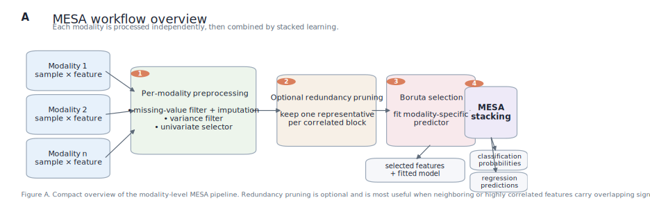

# Multimodal Epigenetic Sequencing Analysis (MESA)

MESA is a Python package for sample-level multimodal cfDNA biomarker modeling. It provides a scikit-learn-style API for preprocessing, feature selection, optional redundancy pruning, modality-specific model fitting, stacked multimodal prediction, and cross-validation.

The package supports both classification and regression.



## Installation

```bash
pip install mesa-cfdna
```

For local development:

```bash
pip install -e .
pytest -q tests
python scripts/run_smoke_checks.py
```

## What MESA Does

- Handles missing-value filtering and imputation
- Applies variance filtering and univariate feature selection
- Optionally prunes redundant correlated features after the first selector
- Uses Boruta for secondary feature selection
- Trains single-modality predictors and stacked multimodal models
- Evaluates models with built-in cross-validation helpers

## Core API

- `MESA_modality`: single-modality pipeline
- `MESA`: multimodal stacking ensemble
- `MESA_CV`: cross-validation wrapper

Default task-aware estimators:
- classification: `RandomForestClassifier`
- regression: `RandomForestRegressor`

`predict_proba()` and `transform_predict_proba()` are available only in classification mode.

## Pipeline Figures

- [Overview figure](figures/mesa_pipeline_overview.svg): compact pipeline summary for README or slides
- [Detailed method figure](figures/mesa_pipeline_detailed.svg): expanded schematic with task-aware branches

Regenerate both figures with:

```bash
source /data/homezvol0/chaoronc/miniconda3/etc/profile.d/conda.sh
conda activate py313
python scripts/generate_pipeline_figures.py
```

## Quick Start

### Classification

```python
from mesa import MESA_modality, MESA, MESA_CV

modality_1 = MESA_modality(
    top_n=50,
    missing=0.2,
    normalization=True,
    redundancy_pruning="score",
    redundancy_threshold=0.95,
    random_state=42,
)

modality_2 = MESA_modality(
    top_n=80,
    missing=0.1,
    redundancy_pruning="model",
    redundancy_threshold=0.95,
    random_state=42,
)

modality_1.fit(X1_train, y_train)
proba_1 = modality_1.transform_predict_proba(X1_test)

mesa = MESA([modality_1, modality_2], random_state=42)
mesa.fit([X1_train, X2_train], y_train)
ensemble_proba = mesa.predict_proba([X1_test, X2_test])

cv_eval = MESA_CV(MESA_modality(top_n=50, random_state=42))
cv_eval.fit(X1_train, y_train)
auc = cv_eval.get_performance()
```

### Regression

```python
from mesa import MESA_modality, MESA, MESA_CV

reg_modality_1 = MESA_modality(
    task="regression",
    top_n=50,
    redundancy_pruning="score",
    redundancy_threshold=0.95,
    random_state=42,
)

reg_modality_2 = MESA_modality(
    task="regression",
    top_n=80,
    random_state=42,
)

reg_modality_1.fit(X1_train, y_train_continuous)
pred_1 = reg_modality_1.transform_predict(X1_test)

reg_mesa = MESA(
    [reg_modality_1, reg_modality_2],
    task="regression",
    random_state=42,
)
reg_mesa.fit([X1_train, X2_train], y_train_continuous)
ensemble_pred = reg_mesa.predict([X1_test, X2_test])

cv_eval = MESA_CV(
    MESA_modality(task="regression", top_n=50, random_state=42),
    task="regression",
)
cv_eval.fit(X1_train, y_train_continuous)
r2 = cv_eval.get_performance()
rmse = cv_eval.get_performance("neg_root_mean_squared_error")
```

## Redundancy Pruning

MESA can prune correlated CpG-like features after the first univariate selector and before Boruta.

- `redundancy_pruning="score"`: keep the best feature in each correlated block using task-aware univariate ranking
- `redundancy_pruning="model"`: keep the best feature in each correlated block using model-based cross-validated ranking
- `redundancy_threshold`: absolute correlation threshold used to define redundant blocks
- `redundancy_method`: correlation method, e.g. `"pearson"`

This step is useful when neighboring or highly correlated features carry redundant signal and would otherwise crowd out other informative loci.

## Key Parameters

### `MESA_modality` parameters

- `task`: learning task, either `"classification"` or `"regression"`.
- `random_state`: random seed used by the default task-aware estimators.
- `boruta_estimator`: estimator used inside Boruta. If omitted, MESA uses a task-aware random forest.
- `top_n`: number of Boruta-selected features retained in the final modality model.
- `variance_threshold`: threshold passed to `VarianceThreshold` after missing-value handling.
- `normalization`: whether to insert `Normalizer()` before variance filtering.
- `missing`: maximum missing fraction tolerated per feature before that feature is removed.
- `redundancy_pruning`: optional correlated-feature pruning strategy, either `None`, `"score"`, or `"model"`.
- `redundancy_threshold`: absolute correlation threshold used to define redundant feature blocks.
- `redundancy_method`: correlation method used during redundancy pruning, for example `"pearson"`.
- `redundancy_estimator`: estimator used to rank features within correlated blocks in `"model"` mode.
- `redundancy_cv`: cross-validation strategy used by model-based redundancy pruning.
- `redundancy_metric`: optional task-aware metric used in model-based redundancy pruning.
- `predictor`: final modality-level estimator. If omitted, MESA uses a task-aware random forest.
- `classifier`: backward-compatible alias for `predictor`.
- `selector`: first-stage univariate selector. An integer is interpreted as `k` in a `GenericUnivariateSelect`; `None` uses the task default.

### `MESA` parameters

- `modalities`: list of `MESA_modality` objects, one per modality.
- `task`: shared learning task for every modality and the meta-estimator.
- `meta_estimator`: second-level estimator fitted on modality outputs. If omitted, MESA uses logistic regression for classification and linear regression for regression.
- `random_state`: random seed used by the default stacking cross-validation splitter.
- `cv`: cross-validation splitter used to generate out-of-fold modality predictions for stacking.

### `MESA_CV` parameters

- `modality`: a `MESA_modality` or `MESA` object evaluated across folds.
- `task`: learning task used for default splitting and scoring.
- `random_state`: random seed used by the default cross-validation splitter.
- `cv`: explicit cross-validation splitter. If omitted, MESA uses a task-aware default.
- `performance_metric`: default metric returned by `get_performance()` when no explicit metric is supplied.

Classification defaults to ROC AUC. Regression defaults to R². Supported regression metrics are `r2`, `neg_mean_squared_error`, `neg_root_mean_squared_error`, `pearson`, and `spearman`.

## Validation Assets

- [demo.ipynb](demo.ipynb): original example notebook
- [pruning_validation_demo.ipynb](pruning_validation_demo.ipynb): pruning-focused synthetic validation
- [regression_validation_demo.ipynb](regression_validation_demo.ipynb): regression validation notebook
- [scripts/run_smoke_checks.py](scripts/run_smoke_checks.py): notebook-free smoke test runner

## Development Notes

- Use pandas `DataFrame` inputs when possible so selected feature indices can be mapped back to columns cleanly.
- For biological interpretation, validate any pruning or selector change on a subset before large runs; these changes can alter feature rankings and downstream performance.
- Human contributor guidance lives in [CONTRIBUTING.md](CONTRIBUTING.md).

## Citation

If you use MESA in research, cite:

Li, Y., Xu, J., Chen, C. et al. Multimodal epigenetic sequencing analysis (MESA) of cell-free DNA for non-invasive colorectal cancer detection. *Genome Medicine* 16, 9 (2024). https://doi.org/10.1186/s13073-023-01280-6

## License

This repository is distributed under the terms in [LICENSE](LICENSE).
